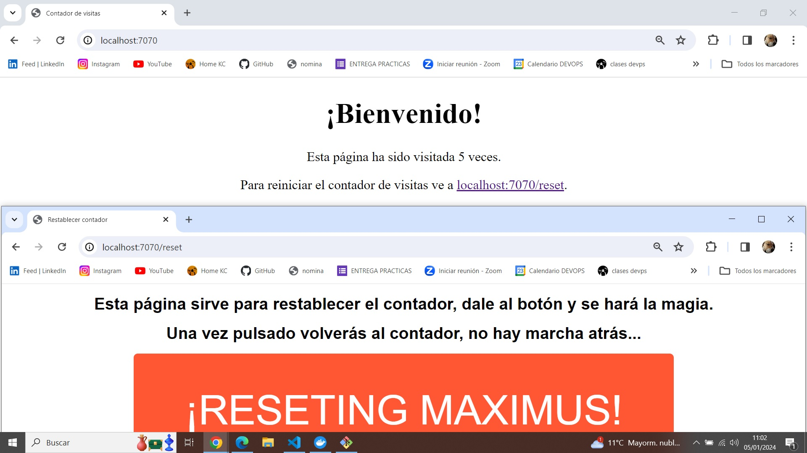

# Práctica Docker & K8s - Albert Fdez

### Apartados de la práctica:
- [Descripción aplicación](#descripción-de-la-aplicación)
- [Docker](#desplegando-en-docker)
- [Dockerhub](#docker-hub)
- [Docker compose](#docker-compose)
- [Kubernetes](#kubernetes)
- [Despliegue k8s](#desplieuge-en-kubernetes)
- [Helm](#helm)
- [Ficheros Helm](#ficheros-helm)
- [Configuración Helm](#configuración-helm-chart)


## Descripción de la Aplicación
Esta aplicación es un contador de visitas web que permite llevar un registro de cuántas veces se accede a una página. Utiliza Flask como framework web y una base de datos SQLite para almacenar el recuento de visitas. Consta de 2 Endpoints:
-  http://localhost:7070/
-  http://localhost:7070/reset

- 


### Requisitos
- Python 3.9 o superior.
- Biblioteca Flask 3.0.0 o superior.
- Docker y Docker Compose (si se va a ejecutar con contenedores).

### Instrucciones para ejecutar la app en Local
1. Clona este repositorio en tu máquina local.
2. Instala las dependencias ejecutando: `pip install -r requirements.txt`.
3. Ejecuta la aplicación con: `python app.py`.
4. Accede a `http://localhost:7070` en tu navegador para ver el contador de visitas.
5. Para restablecer el contador, accede a `http://localhost:7070/reset`.


## Desplegando en docker
Podemos usar tanto el dockerfile como el docker-compose.

### Dockerfile
El  [Dockerfile](Dockerfile) contiene las instrucciones para construir la imagen del contenedor de la aplicación. Utilizamos el enfoque multistage para reducir el tamaño de la imagen final y garantizar su eficiencia.
- En el caso de esta práctica, el Dockerfile está en multistage para minimizar el tamaño de la misma.
- Ejecuta el comando docker build -t <nombre_imagen> . desde el directorio que contiene el Dockerfile y otros archivos necesarios.
- Hay que indicar el puerto en el comando de iniciación del Docker.
```
docker run -p 7070-7070 <nombre_imagen>
```
- Esto mapea el puerto interno 7070 del contenedor al puerto 7070 de tu máquina local.


## Docker Hub

- Una vez verificamos su correcto funcionamiento del contenedor creado, debemos subirlo a http://dockerhub.com mediante los siguientes pasos:

1. Verificamos el nombre de nuestro contenedor:
```
docker container list
```
2. Iniciamos sesion en docker hub mediante el comando:
```
docker login
```
3. Etiquetar correctamente la imagen local con tu nombre de usuario en Docker Hub:
```
docker tag nombreimagen:etiqueta nombreusuario/nombreimagen:etiqueta
```
4. Una vez etiquetada correctamente, puedes subir la imagen a Docker Hub con el comando docker push:
```
docker push nombreusuario/nombreimagen:etiqueta
```
5. Verificamos en http://dockerhub.com
- NOTA(Si disponemos de Docker Desktop, en la misma app se pueden ver los contenedores que tenemos subidos al hub)


## Docker Compose
El archivo [docker-compose.yml](docker-compose.yml) define dos servicios: `webapp` para la aplicación y `db` para la base de datos. Permite ejecutar la aplicación completa localmente con persistencia de datos y comunicación entre contenedores.
- Asegurarse de estar en el mismo directorio que el fichero [docker-compose.yml](docker-compose.yml).
- Podemos iniciar el docker-compose mediante su comando.
```
docker compose up
```

## Verificación del funcionamiento y logs de la app
- Después de ejecutar la aplicación, accede a `http://localhost:7070` y verifica que el contador de visitas funcione correctamente. También verifica que la función de restablecimiento (`/reset`) funcione adecuadamente.
- Los logs de la aplicación se generan en la salida estándar y se pueden ver ejecutando `docker logs <nombre_del_contenedor>` para cada contenedor.


## Kubernetes
A continuación se detallan los manifiestos creados para poder desplegar la app en un clúster de k8s

### Manifiestos
- [app-deployment](k8s\app-deployment.yml)
    - Se encarga del despliegue de la app y define tres réplicas de la aplicación.
    - Administra los pods que ejecutan la imagen feralbert90/counterkc:latest.
    - Asegura que las réplicas se distribuyan en nodos diferentes mediante podAntiAffinity.
    - Configura variables de entorno para la aplicación, obteniendo datos sensibles como la URL de la base de datos desde el secreto llamado db-connection, dicho secreto se encuentra en [secret](k8s\secret.yml).
    - También usa el ConfigMap llamado flask-configmap, ubicado en [app-configmap.yml](k8s\app-configmap.yml),  para configurar la aplicación, como el nivel de registro y la configuración de la misma.

- [db-deployment](k8s\db-deployment.yml)
    - Despliega tres réplicas de un contenedor utilizando la imagen sqlite:latest.
    - Selector y Affinity: Se utiliza la afinidad de pod para garantizar que los pods se desplieguen en hosts diferentes. Esto se logra mediante la expresión de afinidad requiredDuringSchedulingIgnoredDuringExecution.
    - El contenedor se nombra sqlite-db y utiliza la imagen sqlite:latest.
    - Se define un volumen persistente llamado db-storage, con un reclamo de almacenamiento de 1 gigabyte y un modo de acceso ReadWriteOnce. Este volumen se monta en el directorio /var/lib/sqlite del contenedor para almacenar datos de la base de datos SQLite.

- [app-internal-svc](k8s\app-internal-svc.yml)
    - Usamos la etiqueta app: counter-app para encontrar y dirigirnos a los pods asociados a esta aplicación.
    - Definimos un puerto (port: 7070) dentro del servicio que estará disponible para recibir tráfico externo y lo direcciona al puerto 7070 donde la aplicación dentro de los pods está escuchando. 
    Esto permite que los recursos externos se comuniquen con la aplicación dentro de los pods a través de este puerto específico.

- [app-external-svc](k8s\app-external-svc.yml)
    - Definimos el tipo del servicio, en este caso, LoadBalancer. Si el entorno no soporta LoadBalancer, se utiliza NodePort.
    - Utilizamos la etiqueta app: counter-app para encontrar y dirigirnos a los pods asociados a esta aplicación.
    - Exponemos el puerto 80 como el punto de entrada externo para acceder al servicio. 
    Este servicio redirige el tráfico entrante en el puerto 80 al puerto 7070 donde la aplicación está escuchando dentro de los pods.

- [app-ingress](k8s\app-ingress.yml)
    - Este manifiesto de Kubernetes describe un Ingress, que actúa como una capa de entrada para el tráfico externo que se dirige a los servicios de la aplicación
    - Definimos los metadatos adicionales para el Ingress, como el controlador de Ingress nginx y la reescritura de la URL base (nginx.ingress.kubernetes.io/rewrite-target: /).
    - Definimos las reglas para enrutar el tráfico entrante:
        - Host: Se espera que las solicitudes provengan del host localhost.
        - HTTP Paths: Define cómo deben manejarse las solicitudes HTTP para el host especificado.
            - PathType: Especifica el tipo de ruta que se está utilizando (Prefix en este caso).
            - Path: El path base (/) al que se dirigen las solicitudes.
            - Backend: Define cómo se resuelve y maneja el tráfico que llega a este path. En este caso, se redirige al servicio counter-app-service en el puerto 7070.

- [app-configmap.yml](k8s\app-configmap.yml)
    - Este manifiesto describe un ConfigMap en Kubernetes, una forma de almacenar datos de configuración:
    - Definimos los datos de configuración que se almacenan en el ConfigMap, serán 3:
        - APP_CONFIG: Define la configuración de la aplicación (development en este caso).
        - LOG_LEVEL: Define el nivel de registro de los mensajes de registro (debug en este caso).
        - MAX_CONNECTIONS: Establece el número máximo de conexiones permitidas (100 en este caso).

- [secret](k8s\secret.yml)
    - Describimos un recurso Secret en Kubernetes llamado db-connection que contiene una clave llamada DATABASE_URL que almacena una URL de base de datos codificada en Base64 para proteger la información sensible.

- [statefulset.yml](k8s\statefulset.yml)
    - Configuramos tres réplicas de una aplicación llamada sqlite-db utilizando una imagen sqlite:latest
    - Cada réplica tiene un volumen persistente de 1Gi montado en /var/lib/sqlite, lo que garantiza la persistencia de los datos en la base de datos SQLite. 
    Además, asegura que estos pods se ubiquen en nodos compatibles según la afinidad definida, manteniendo la disponibilidad y la coherencia del estado de la aplicación.

### Desplieuge en Kubernetes
Asegúrate de tener Kubernetes instalado y configurado en tu entorno local o en el clúster donde quieres desplegar la aplicación. Verifica que kubectl esté configurado para interactuar con tu clúster.
Para poder desplegar nuestra app en k8s es necesario aplicar todos los manifiestos mencionados anteriormente:
 1. Secretos y Configuraciones:
    - Es preferible crear primero los secretos y configmaps necesarios para la base de datos y la configuración de la aplicación, ya que estos son requisitos previos para el despliegue:

    ```
    kubectl apply -f secret.yaml
    ```
    ```
    kubectl apply -f configmap.yaml
    ```
2. Despliegue de la Base de Datos:
    - Utiliza el StatefulSet definido para implementar la base de datos en Kubernetes. Este archivo YAML contiene la configuración necesaria para desplegar la base de datos como un conjunto de pods. Ejecuta el siguiente comando:

    ```
    kubectl apply -f sqlite-db-statefulset.yaml
    ```
3. Despliegue de la Aplicación:
    - Utiliza el Deployment y los Service que se han definido para la aplicación. Estos archivos YAML contienen la configuración para desplegar la app. Ejecuta los siguientes comandos:
    ```
    kubectl apply -f counter-app-deployment.yaml
    ```
    - En caso de querer crear un servicio externo para acceder a la app desde fuera del clúster, para que el tráfico externo llegue a la app:
    ```
    kubectl apply -f app-external-svc.yml
    ```
    - En caso de querer crear un servicio interno, ideal para limitar el acceso al clúster:
    ```
    kubectl apply -f app-internal-svc.yml
    ```
4. Exponer la Aplicación al Exterior (Opcional):
    - En caso de desear que la aplicación sea accesible de manera más controlada desde fuera del clúster (por ejemplo, para pruebas externas)
    - El Ingress actúa como un enrutador que permite el acceso externo a servicios específicos dentro del clúster.
    ```
    kubectl apply -f counter-app-ingress.yaml
    ```


## Helm

Con Helm podemos definir aplicaciones en lo que se llama un "Chart". Un Chart es un paquete de Kubernetes que contiene información y recursos necesarios para desplegar una aplicación. Esto incluye los manifiestos de Kubernetes, como los Deployments, Services, ConfigMaps, Secrets, entre otros, así como archivos de configuración, plantillas y valores predeterminados.

- Helm ayuda a estandarizar y automatizar el despliegue de aplicaciones en Kubernetes, permitiendo una gestión más fácil, repetible y controlada de las implementaciones. Además, posibilita compartir y reutilizar configuraciones a través de Charts, lo que facilita el trabajo en equipos y la adopción de buenas prácticas.

- Despliegue en Kubernetes: 
    - Helm se encargará de interpretar los valores del Chart, generar los recursos de Kubernetes y desplegar tu aplicación en el clúster.

- Actualización y gestión: 
    - Puedes actualizar la configuración de tu aplicación editando los valores del Chart y luego aplicando la actualización con el comando 'helm upgrade'. También puedes desinstalar la aplicación con 'helm uninstall'.

### Ficheros Helm

- [Tests](charts-counter-app\templates\tests): Contiene un archivo YAML para ejecutar pruebas. En este caso, se usa un pod para verificar la conexión a la aplicación.
- [_helpers.tpl](charts-counter-app\templates\_helpers.tpl): Archivo de plantilla con diversas funciones y definiciones para facilitar la generación de nombres y etiquetas.
- [Deployment](charts-counter-app\templates\deployment.yaml): Define el despliegue de tu aplicación. Aquí se establece la configuración de los Pods, las imágenes, los puertos, las sondas de estado, los recursos, etc.
- [Horizontal Pod Autoscaler](charts-counter-app\templates\hpa.yaml)(HPA): Define el escalado automático basado en métricas como el uso de CPU o memoria.
- [Ingress](charts-counter-app\templates\ingress.yaml): Configura las reglas para acceder a la aplicación desde fuera del clúster, estableciendo rutas y hosts.
- [Service](charts-counter-app\templates\service.yaml): Define un servicio para exponer tu aplicación dentro del clúster.
- [Service Account](charts-counter-app\templates\serviceaccount.yaml): Opcionalmente, crea una cuenta de servicio si se ha configurado en las opciones.
- [.helmignore](charts-counter-app\.helmignore): Archivo para especificar patrones que Helm debería ignorar al empaquetar el Chart.
- [chart.yaml](charts-counter-app\Chart.yaml): Archivo de metadatos que proporciona información sobre el Chart, como la versión, descripción, tipo y versión de la aplicación.
- [values.yaml](charts-counter-app\values.yaml): Archivo con los valores predeterminados de configuración para tu Chart. Aquí se definen las imágenes, los puertos, la configuración de la base de datos, las réplicas, la escalabilidad automática, entre otros.
Cada uno de estos archivos y plantillas contribuye a la configuración y despliegue de tu aplicación en Kubernetes utilizando Helm.

## Configuración helm chart

Este Chart de Helm ofrece varias opciones de configuración para adaptar la instalación de la aplicación a tus necesidades específicas. A continuación, se detallan las principales variables que pueden modificarse en el archivo values.yaml:

- Configuración de la Aplicación
    - replicaCount: Número de réplicas para el despliegue de la aplicación.
    - image.repository: Repositorio de la imagen de la aplicación.
    - image.tag: Etiqueta de la imagen de la aplicación a desplegar.

- Configuración del Servicio
    - service.type: Tipo de servicio para exponer la aplicación. Puede ser ClusterIP, NodePort, LoadBalancer o ExternalName.
    - service.port: Puerto del servicio de la aplicación.
- Configuración del Ingress
    - ingress.enabled: Habilitar o deshabilitar el Ingress para exponer la aplicación externamente.
    - ingress.hosts: Lista de hosts que se utilizarán para el Ingress.
    - ingress.tls: Configuración de TLS/SSL para el Ingress.
- Configuración de Recursos
    - resources: Recursos de CPU y memoria asignados a la aplicación.
- Configuración de Escalado Automático
    - autoscaling.enabled: Habilitar o deshabilitar el escalado automático de la aplicación.
    - autoscaling.minReplicas: Número mínimo de réplicas para el escalado automático.
    - autoscaling.maxReplicas: Número máximo de réplicas para el escalado automático.
    - autoscaling.targetCPUUtilizationPercentage: Umbral de uso de CPU para el escalado automático.
    - autoscaling.targetMemoryUtilizationPercentage: Umbral de uso de memoria para el escalado automático.
- Configuración Avanzada
    - configmap: Configuración específica para la creación del ConfigMap.
    - secret: Configuración específica para la creación del Secret.
    - persistentvolumeclaim: Configuración para la creación de PersistentVolumeClaims.

Estos son solo algunos de los parámetros que pueden ajustarse para personalizar la instalación del Chart de Helm. Para más detalles y opciones de configuración, consulta el archivo [values.yaml](charts-counter-app\values.yaml) en el directorio raíz del Chart.

Este README ofrece una visión general de las opciones de configuración disponibles en el Chart de Helm y sirve como guía para aquellos que deseen modificar y adaptar el despliegue de la aplicación a sus requisitos o necesidades específicoa.